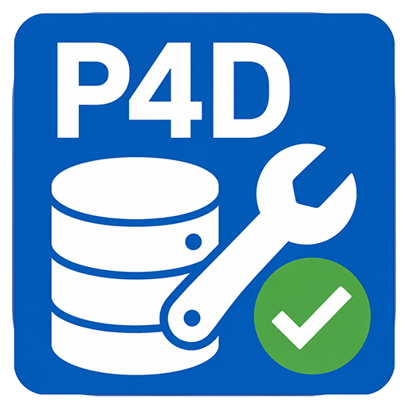

<p align="center">
  
</p>

<h1 align="center">SSH Toolkit (Linux)</h1>

<p align="center">
  <b>One-click bash script for Perforce P4D on Ubuntu — deploy, rescue, and self-heal.</b><br/>
  <sub>Perforce P4D 一键运维脚本 — 部署 / 救援 / 自动自愈(Ubuntu)</sub>
</p>

<p align="center">
  
  
  
  <a href="LICENSE"></a>
</p>

---

## Quick start / 快速开始

```bash
curl -fsSL https://raw.githubusercontent.com/ziwuxin1/p4d-toolkit-linux/main/p4d-toolkit.sh -o p4d-toolkit.sh && sudo bash p4d-toolkit.sh
```

进菜单后选 **5)一次性全部部署** — 5 分钟从空白 Ubuntu 到生产就绪。

## Menu / 菜单

```
── 部署 ──
1) 安装 P4D 2024.1
2) 装 license 文件
3) 配 systemd + 启动自愈 hook
4) 配每日 03:00 checkpoint cron + rsync
5) 一次性全部部署

── 救援 ──
6) Counter 救援
7) 一键恢复

── 体检 ──
10) 健康体检
11) 备份状态
12) systemd journal

── 维护 ──
13) 立刻 checkpoint
14) 立刻 rsync
15/16/17) 启 / 停 / 重启 服务

── 卸载 ──
99) Uninstall(数据库保留)
```

## Non-interactive

```bash
sudo bash p4d-toolkit.sh status          # 健康体检
sudo bash p4d-toolkit.sh checkpoint      # 立刻 checkpoint
sudo bash p4d-toolkit.sh counter-rescue  # Counter 救援
sudo bash p4d-toolkit.sh restore         # 一键恢复
```

## License

[MIT](LICENSE) · 100% based on [P4D-Migration-Complete-Guide.md](P4D-Migration-Complete-Guide.md)
